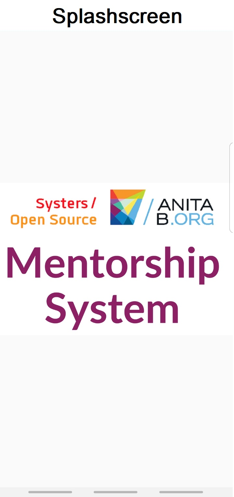

# Mentorship System (Android)

| Branch | [Travis](https://travis-ci.org/) | [Codacy](https://www.codacy.com/) |
| :---: | :---: | :---: |
| [master](https://github.com/anitab-org/mentorship-android/tree/master) |  |  |
| [develop](https://github.com/anitab-org/mentorship-android/tree/develop) |  |  |

[Mentorship System](https://github.com/anitab-org/mentorship-backend) is an application that allows women in tech to mentor each other, on career development topics, through 1:1 relations for a certain period.

This is the Android client for the Mentorship System.

## Features

* A member gets an option to be a Mentor, Mentee or Both.
* A member can build/customise the app profile with username, bio, skills, interests, location, occupation, etc. anytime. 
* A member can view a list of other members and search for a member on the Members Page
* A member can either send mentorship requests to other members as a Mentor or Mentee according to their interests or reject mentorship requests from other members.
* A member can track the number of **Pending Resquests**, **Accepted Requests**, **Rejected Requests**, and **Completed Requests** and view **Recent Achievements** on the Home Page.  
* A member can view the details of pending, past, all the mentorship reqests in the Requests Page.
* A member can create, update, or delete tasks in their current mentorship relation.
* A member can send feedback about the Mentorship System such as reporting a bug, giving suggestions or other comments.
* A member can delete their account.
* A member can change their account password anytime.

## Setting up the project

To setup the project locally read these wiki pages and follow the instructions:

 - [Fork, Clone and Remote](https://github.com/anitab-org/mentorship-android/wiki/Fork%2C-Clone-%26-Remote)
 - [Open project in Android Studio](https://github.com/anitab-org/mentorship-android/wiki/Open-the-project-in-Android-Studio)

## Contributing 

Please read our [Contributing guidelines](https://github.com/anitab-org/mentorship-android/blob/develop/.github/CONTRIBUTING.md), [Code of Conduct](http://systers.io/code-of-conduct) and [Reporting Guidelines](http://systers.io/reporting-guidelines)

Please follow our [Commit Message Style Guide](https://github.com/anitab-org/mentorship-android/wiki/Commit-Message-Style-Guide) while sending PRs.

## Documentation

To learn more about this app you can look at [this project's wiki](https://github.com/anitab-org/mentorship-android/wiki).

Check out the design history at [User Interface Design](https://github.com/anitab-org/mentorship-android/wiki/User-Interface-Design).

Our tech stack includes:
- **Language:** [Kotlin](https://kotlinlang.org/)
- **Architecture:** Model View ViewModel (MVVM)
- **Libraries:** [Retrofit](http://square.github.io/retrofit/), [RxJava](https://github.com/ReactiveX/RxJava), ViewModel, LiveData, DataBinding

## Branches

The repository has the following permanent branches:

 * **master** This contains the code which has been released.

 * **develop** This contains the latest code. All the contributing PRs must be sent to this branch. When we want to release the next version of the app, this branch is merged into the `master` branch.

 * **apk** This branch contains the apks for the code in the develop branch. The apks are automatically updated when a commit is pushed to `develop` branch.

## Screenshots
|||| 
|---|---|---|
|||| 
|||
||||
|||
## Contact

You can reach our community at [AnitaB.org Open Source Zulip](https://anitab-org.zulipchat.com/).

We use [#mentorship-system](https://anitab-org.zulipchat.com/#narrow/stream/222534-mentorship-system) stream on Zulip to discuss this project and interact with the community. If you're interested in contributing to this project, join us there!

## License

Mentorship System is licensed under the GNU General Public License v3.0. Learn more about it in the [LICENSE](LICENSE) file.
