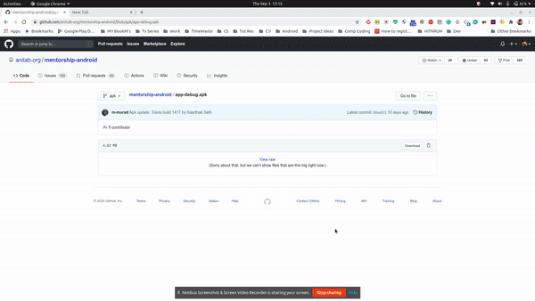

# How to test App:
- Using Physical device and apk
- Using Emulator and Apk
- Directly Running in Android Studio ( Recommended )

## For option one or two:

Every time a new commit is merged into the `develop` branch an _apk_ is released in the `apk` branch. To Navigate to `apk` Branch see here: 

If you want to do manual testing of the application without setting up the development environment, you can download this [app-debug.apk](https://github.com/anitab-org/mentorship-android/blob/apk/app-debug.apk) and install it on your Android device.

For Testing on a physical device tick the option here :

Now click the apk to install !

## For Testing on Emulator with APk :

1. Now Open the project in Android Studio
2. Wait untill all background process are finished 
3. Click on the AVD button or select from already created devices in Android studio  

4. For information on how to create an Emulator and Run it visit [Creating an AVD](https://developer.android.com/studio/run/managing-avds#createavd)
5. Now Run the Emulator you have created 

6. Navigate to the apk file downloaded 

7. Drag and Drop the Apk file into the Emulator.
8. Now just look for the App in App tray and click to open.

## For running through Android Studio
1. [Clone the repository](https://github.com/anitab-org/mentorship-android/wiki/Fork,-Clone-&-Remote) follow the instructions here.
2. Repeat step 1-5 of **Testing on Emulator with APk** 
3. Press the Run 'app' button now as shown 

4. Wait for the emulator to load up. Rest the IDE would handle. ;)  
5. Now your app is ready to test any changes made (*ps: make sure to press run 'app' button to reinstall the app in emulator*)
6. 

- Now Test the app as required. :)

If you want ideas of test cases to use when testing the mobile application business logic, you can check this set of Quality Assurance test cases page from [anitab-org/mentorship-backend](https://github.com/anitab-org/mentorship-backend) repository.

Resources:
- [Apk branch](https://github.com/anitab-org/mentorship-android/tree/apk)
- [app-debug.apk](https://github.com/anitab-org/mentorship-android/blob/apk/app-debug.apk)
- [Quality Assurance test cases](https://github.com/anitab-org/mentorship-backend/blob/develop/docs/quality-assurance-test-cases.md)
