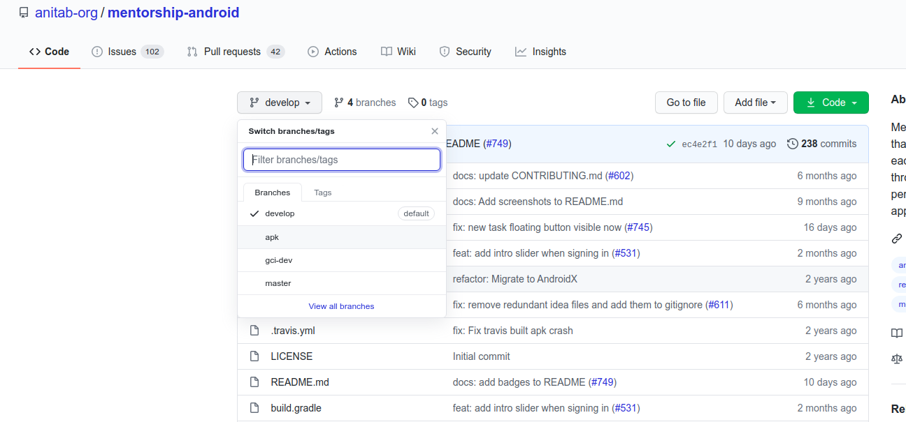
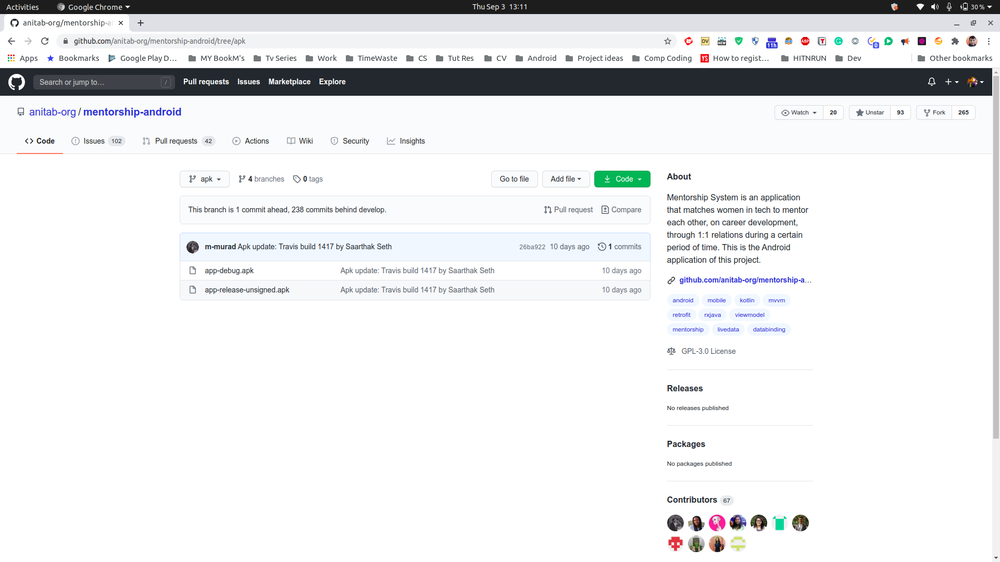
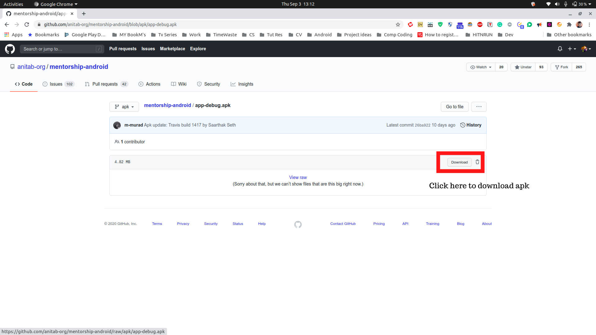
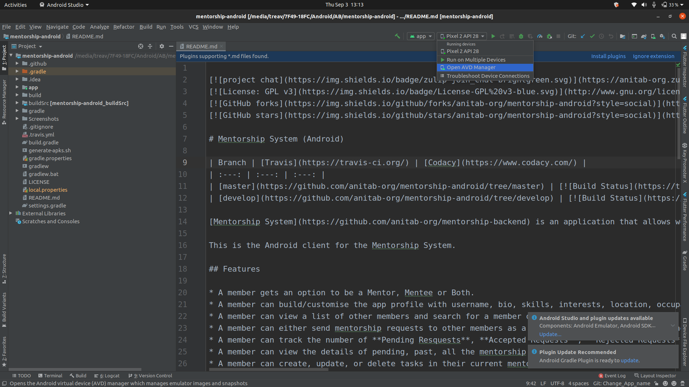
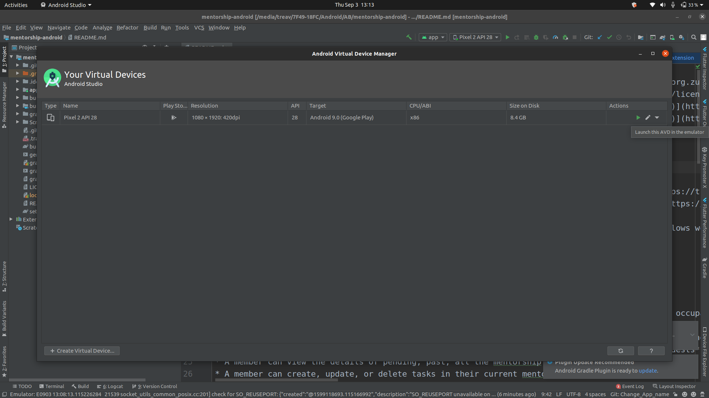
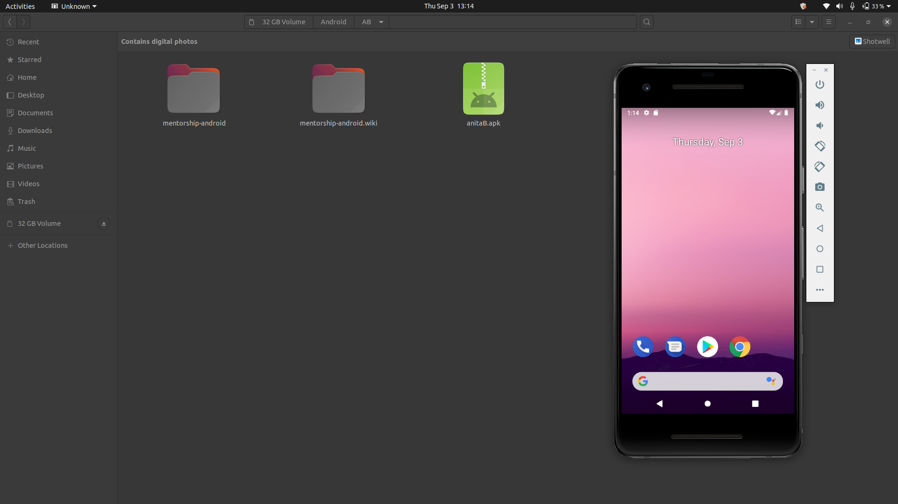

Every time a new commit is merged into the develop branch an apk is released in the apk branch.To Navigate to apk Branch see here : 

If you want to do manual testing on the application without setting up the development environment, you can download this app-debug.apk and install it on your Android device.

For manually testing in physical device tick the option here :

Now click the apk to install !

For Testing on Emulator :

- Now Open the project in Android Studio
- Wait untill all background process are finished 
- click the ADV button or click from already created devices in Android studio click 

- For information on how to create an Emulator and Run it visit [Creating an ADV](https://developer.android.com/studio/run/managing-avds#createavd)
- Now Run the Emulator you have created 

- Navigate to the apk file downloaded 

- Drag and Drop the Apk file into the Emulator.
- Now just look for the App in App tray and click to open.

- Now Test the app as required. :)

If you want ideas of test cases to use when testing the mobile application business logic, you can check this set of Quality Assurance test casespage from systers/mentorship-backend repository.
Resources: - Apk branch - app-debug.apk - Quality Assurance test cases
