# Workflow of Mentorship System Android App

Mentorship System is an application that allows women in tech to mentor each other, on career development topics, through 1:1 relations for a certain period.

### Splash Screen
Splash screen of AnitaB.Org Mentorship system will launch for few seconds as part of introduction to app.

### Onboarding Screen
Once the App is installed user can view an onboarding screen which introduces the app and give user an idea of how it works.

### Sign Up Page
Firstly, the user will encounter the Sign Up page where he need to fill the details like his Name, User Name, Email, Password, etc.
Here, user is also allowed to select whether he wants to be mentee, mentor or both. User must read the Code of conduct, terms, privacy policy and mark it check in the check-box.   
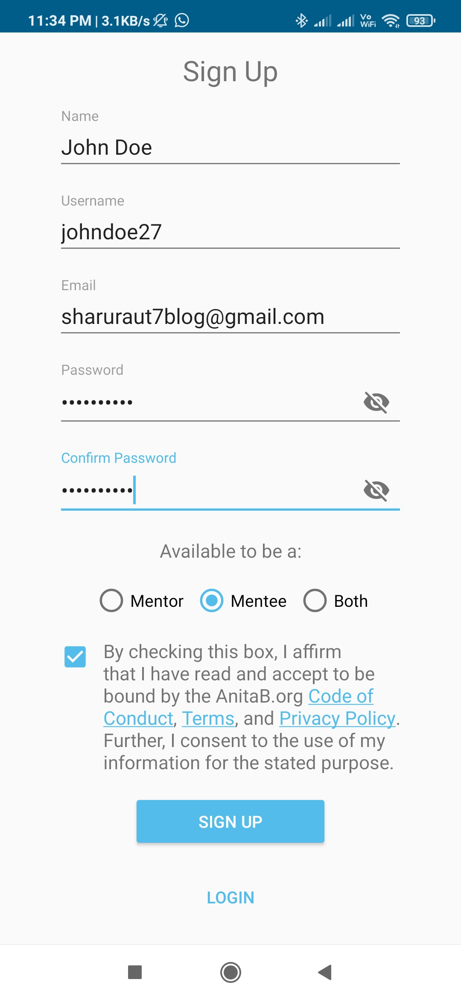

### Email Confiramation
After getting registered the confirmation mail is sent to the registered email ID of user to confirm and then the link will redirect to the confirmation page in a browser.  

### Login Page
After getting confirmed the details are to be entered in order to login and access the featuers of the app.   

### Home Screen
After getting logged into the app, the first screen the user will see is the home screen where user can see accepted, rejected, completed and pending requests and achievements. At the bottom there is a navigation bar where user can navigate to different sections.   
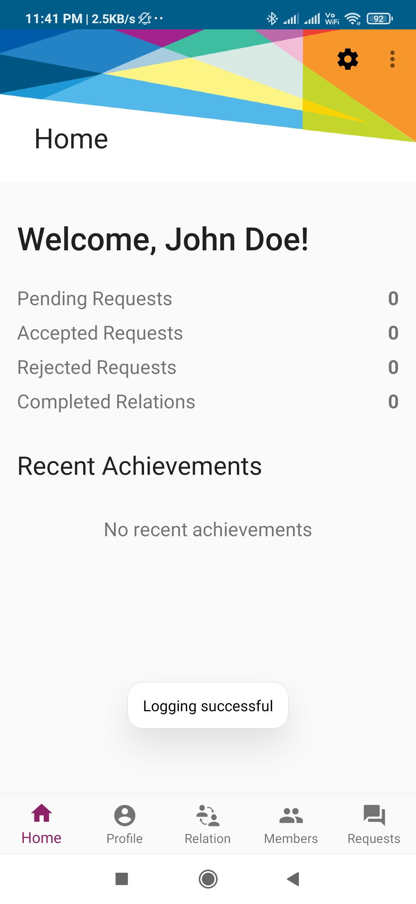

### User Profile
User can view and edit the name, bio, zulip username, location and occupation in the profile section. Also, user can set toggle buttons to available to mentor or need mentoring according to his requirements.   
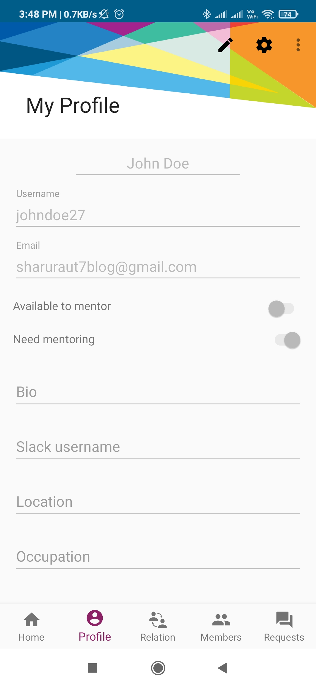

### Member Section
User can check the members in the members section which he wants to connect with. The user can filter members by the label **need mentoring** or **available to mentor**, interest, location and skills. A user can search for particular members there in Mentorship System. Also, can sort other members on the basis of their name either (A-Z) OR (Z-A), registration date, age.    
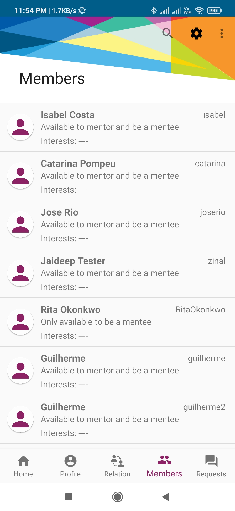

### Member Profile
User check the member profile and send them requests.   
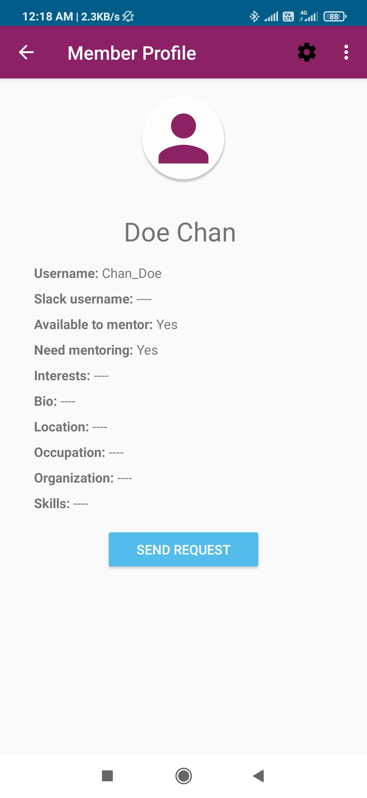

### Send Request
Request can be sent to members to mentor or mentee with note.  
 
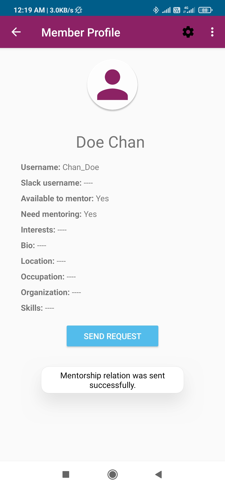

### Requests Section
User can check the pending, past and all the requests here.   
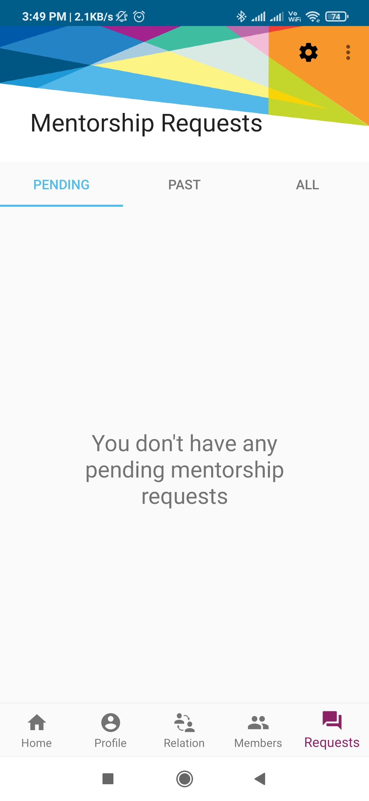 

### Accepting/Rejecting Requests 
User which will send the request to the member and member will get this to accept/reject the request.   
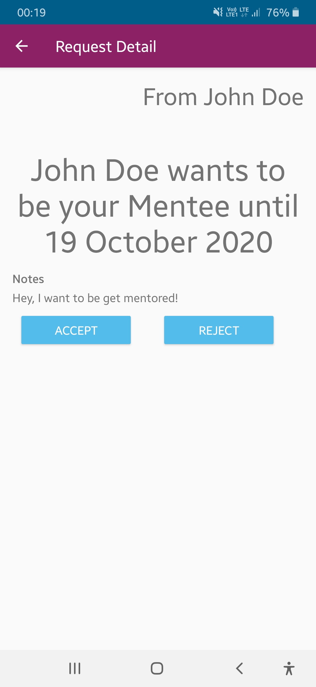

### Relation Section
User check the current relation in the relation section.   

### Tasks  
The user or member can give tasks to each other according to what they have choose to be and mark them as complete after completing.  
 
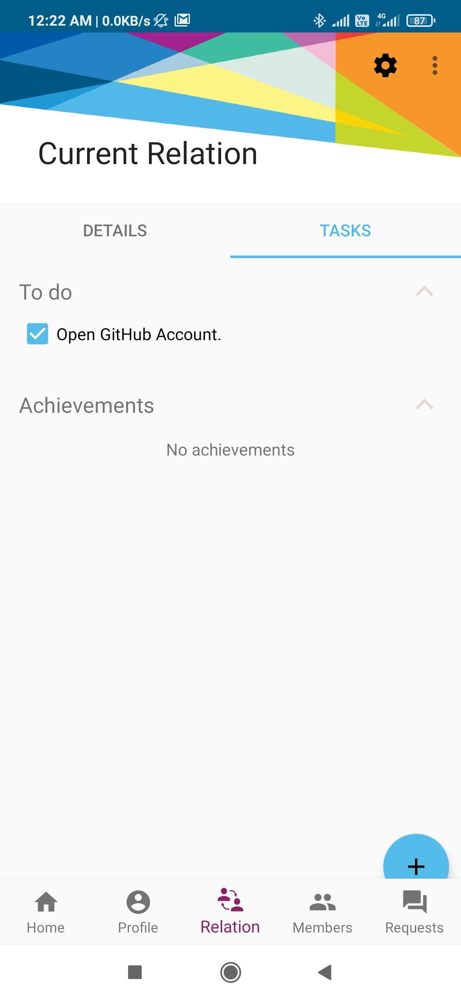

### Settings Page
Settings page contains About, Feedback, Logout, Change Password and Delete Account options. Here, Logout button will allow user to log out of the account and will bring back to the login page. Delete button will delete the user's account permenantly from the mentorship system.   

### About Page
About Page contains the short information about the mentorship system.   

### Change Password
Change Password facility is available for user to change password.   
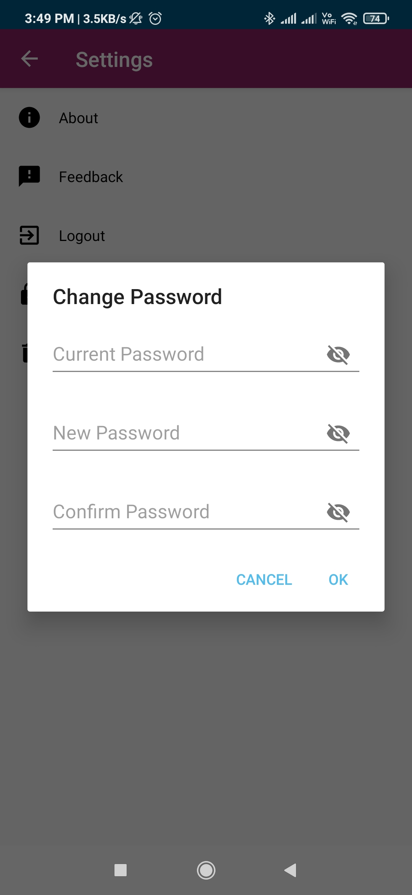

### Feedback Page
User can give positive or negative Feedback or any suggestions in the feedback page.   
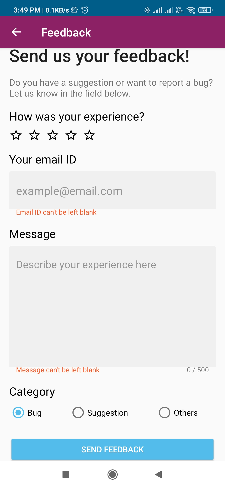

