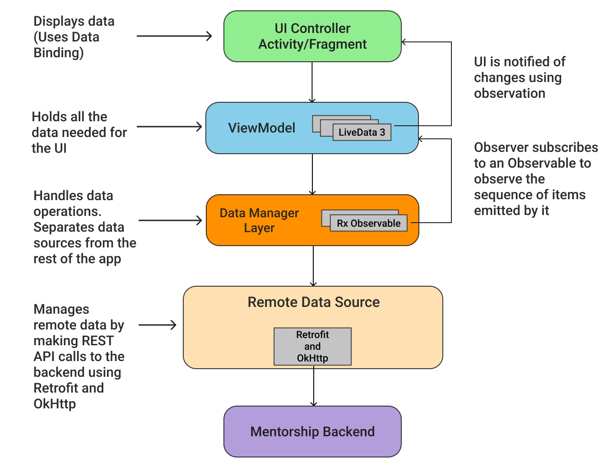

# Application Architecture - MVVM

### Contents

- <a href="#model-view-viewmodel">MVVM</a>
- <a href="#overview">Overview</a>
- <a href="#displaying-data">Displaying Data</a>
- <a href="#fetching-data">Fetching Data</a>
<br>

### Model View ViewModel

- <b>MVVM architecture :</b> A recommended architecture for apps that use <a herf="https://developer.android.com/topic/libraries/architecture">Architecture Components</a>. It consists of a UI Controller <code>(Activity/Fragment)</code>, <code>ViewModel</code> that serves <code>LiveData</code>, Data Manager Layer that emits a sequence of <code>Observables</code> and a remote data layer that interacts with the API endpoints exposed by the backend. <a href="https://github.com/anitab-org/mentorship-backend">Mentorship Backend</a> is the backend REST API for this application.

- <b>Separation of Concerns: </b> In MVVM, code is separated into layers and components such that each have distinct functionality with as little overlap as possible. Below is a short overview of the components and how they work together.

<br>

### Overview

- Consider the following diagram which shows how all the components of the application interact with each other
<br>

<p align="center">

</p><br>

- Each component depends only on the component one level below it. For example, <code>Activities</code> and <code>Fragments</code> depend only on a <code>ViewModel</code>. Similarly, <code>ViewModel</code> depend on Data Manager Layer which then depends on the Remote Data Source. This ensures <b>Separation of Concerns</b> as mentioned above. Each component is explained more below.

<br>

### Displaying Data

- The UI consists of <code>Activities</code> and <code>Fragments</code>.

- For example, let's take <code>HomeFragment</code>. This fragment is responsible for showing a welcoming message and show some statistics of the User's usage of the app. It is embedded in the <code>MainActivity</code> and its corresponding layout file is <code>fragment_home.xml</code>.

- So, to drive the UI, it needs to hold the <code>HomeStatistics</code>, a data class that represents statistics of the user actions on the app. <br> <br> <code><b>HomeStatistics</b></code>

  ```kotlin
  @Parcelize
  data class HomeStatistics( val name: String, ... ) : Parcelable
  ```
  
- As each component depends only on the component one level below it, <code>HomeViewModel</code> (based on the ViewModel architecture component) is used to keep this information. <code>ViewModel</code> allows data to survive configuration changes such as screen rotations. It exposes the user's statistics to the <code>HomeFragment</code> in the form of <code>LiveData</code>. <br> <br> <code><b>HomeViewModel</b></code>

  ```kotlin
  class HomeViewModel : ViewModel() {
    val userStats: LiveData<HomeStatistics>
    // Some Code
  }
  ```
  
- <a href="https://developer.android.com/topic/libraries/data-binding">Data Binding</a> is used to bind UI components in layouts to data sources using a declarative format rather than programmatically. The data received from the <cdoe>ViewModel</code> is binded to the respective xml layout using data binding. It is implemented as follows : <br> <br> <code><b>HomeFragment</b></code>
  
  ```kotlin
  class HomeFragment : BaseFragment() {
  
      ...
    
      private val homeViewModel by lazy {
          ViewModelProviders.of(this).get(HomeViewModel::class.java)
      }
      private lateinit var binding: FragmentHomeBinding
    
      ...
    
      // Inflating Binding Layout
      override fun onCreateView(inflater: LayoutInflater, container: ViewGroup?, savedInstanceState: Bundle?): View? {
          binding = DataBindingUtil.inflate(inflater, getLayoutResourceId(), container, false)
          return binding.root
      }
    
      ...
    
      // Observing LiveData on the Fragment
      override fun onActivityCreated(savedInstanceState: Bundle?) {
          with(homeViewModel) {
              userStats.observe(viewLifecycleOwner, Observer { stats ->
                  binding.stats = stats
                
                  ...
                
              })
          }
      }
  }
  
  ```
  
  <code><b>fragment_home.xml</b></code>
  
  ```xml
    <data>
        <variable
            name="stats"
            type="org.systers.mentorship.models.HomeStatistics" />
    </data>
    
    ...
    
    <androidx.appcompat.widget.AppCompatTextView                            
      android:text="@{stats != null ? (@string/welcome + `, ` + stats.name + `!`) : `Welcome!` }" />
  ```
  
<br>

### Fetching Data 

- <a href="https://github.com/square/retrofit">Retrofit</a> library is used to access <a href="https://github.com/anitab-org/mentorship-backend">Mentorship Backend</a>. Various services are used to communicate with the application's backend. Services are nothing but simple interfaces which consumes backend's REST API endpoints. An <code>ApiManager</code> is used to encapsulate these services.

  ```
    ApiManager___   // Services
                |
                |___ AuthService
                |
                |___ RelationService
                |
                |___ UserService
                |
                |___ TaskService
                
  ```
  
- Here's a definition of <code>UserService</code>. It contains a function which sends a <code>GET</code> request to the backend's REST API.  It returns the received response in the form of <code>Observable</code> instance of <code>HomeStatistics</code>, which is then observed by the <code>HomeViewModel</code>. <br> <br> <code><b>UserService</b></code>

  ```kotlin
  /**
   * This interface describes the methods related to Users REST API
   */
  interface UserService {
      @GET("home")
      fun getHomeStats(): Observable<HomeStatistics>
      
      // Some more code
  }
  ```

- User's data is <b>not</b> fetched directily from the <code>HomeViewModel</code> because: 
  - That gives too much responsibility to the <code>ViewModel</code>, which violates the <b>separation of concerns</b> principle. 
  - Additionally, the scope of a <code>ViewModel</code> is tied to an <code>Activity</code> or <code>Fragment</code> lifecycle, which means that the data is lost when the associated UI object's lifecycle ends. This behavior creates an undesirable user experience.
So, another layer is used to do the data-fethcing process i.e. <b>Data Manager Layer</b>.

- A data manager layer is very similar to a <a href="https://codelabs.developers.google.com/codelabs/kotlin-android-training-repository/#5">Repository</a>. A layer that separates data source from the rest of the app. It mediates between a remote data source and rest of the app. It provides a clean API for data access to the rest of the app. <br> <br> <code><b>UserDataManager</b></code>

  ```kotlin
  class UserDataManager {
      // An instance of ApiManager
      private val apiManager = ApiManager.instance
      
      /**
       * This function fetches user statistics
       * Uses UserService
       * @return an observable of [HomeStatistics]
       */
      fun getHomeStats(): Observable<HomeStatistics> {
          return apiManager.userService.getHomeStats()
      }
      
      // More code
  }
  ```
  
- As these functions return <code>Observable</code>. The response is observed on <code>HomeViewModel</code>. <br> <br> <code><b>HomeViewModel</b></code>

  ```kotlin
  class HomeViewModel : ViewModel() {
      
      // Lazy initialization of UserDataManager
      private val userDataManager by lazy { UserDataManager() }
      
      // A container which can hold multiple disposable and offers O(1) complexity of adding and removing disposables.
      private val compositeDisposable by lazy { CompositeDisposable() }

      private val _userStats = MutableLiveData<HomeStatistics>()
      
      // To be observed by the fragment
      val userStats: LiveData<HomeStatistics>
        get() = _userStats
        
      fun getHomeStats() {
        userDataManager.getHomeStats()
                .subscribeOn(Schedulers.io())
                .observeOn(AndroidSchedulers.mainThread())
                .subscribeWith(object: DisposableObserver<HomeStatistics>() {

                    override fun onNext(statistics: HomeStatistics) {
                        _userStats.value = statistics
                    }
                    
                    ...

                })
                .addTo(compositeDisposable)
      }
  }
  
  ```

### References

- <a href="https://developer.android.com/jetpack/guide">Guide to App Architecture</a>
- <a href="https://developer.android.com/topic/libraries/architecture">Android Architecture Components</a>
- <a href="https://codelabs.developers.google.com/codelabs/kotlin-android-training-data-binding-basics/index.html?index=..%2F..android-kotlin-fundamentals#2">Data Binding</a>
- <a href="https://github.com/ReactiveX/RxJava">RxJava</a>, <a href="https://github.com/ReactiveX/RxKotlin">RxKotlin</a> and <a href="https://github.com/ReactiveX/RxAndroid">RxAndroid</a>
- <a href="https://github.com/square/retrofit">Retrofit</a>

