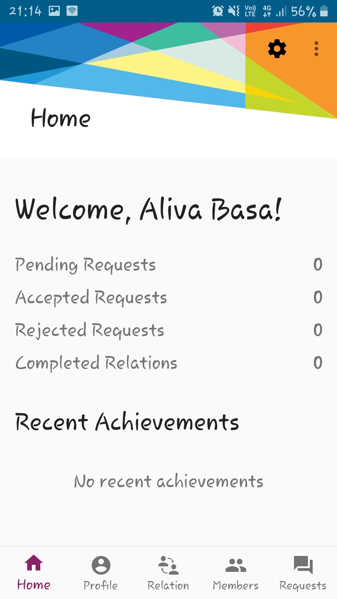
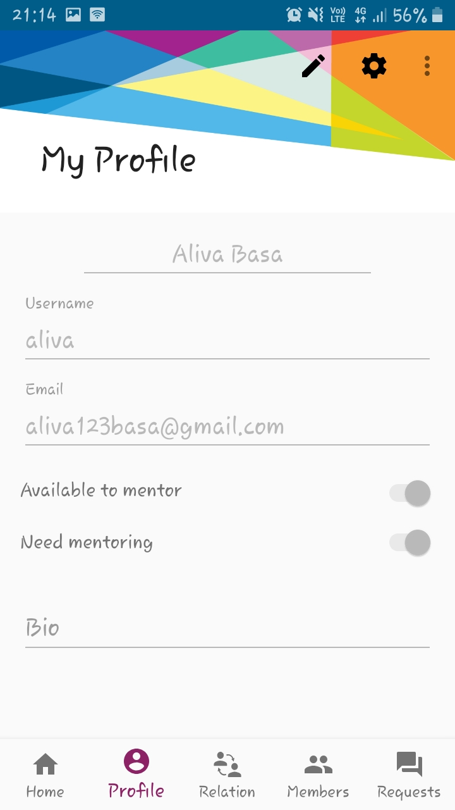
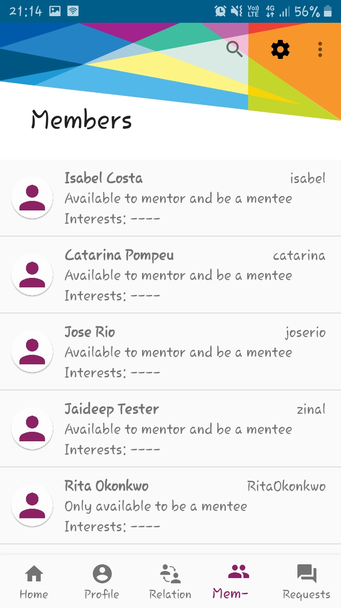
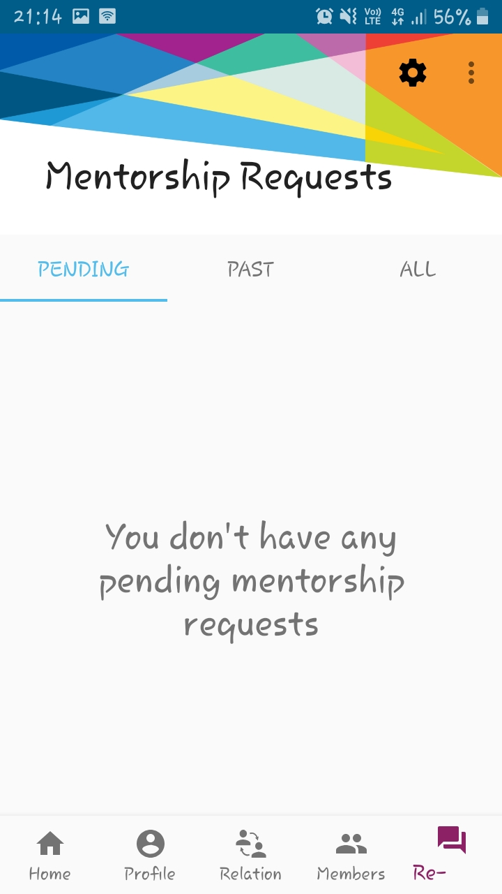

Login Page

Pros: 

    1. White background
    
    2. "Mentorship System" font size.
    
    3. Spacing between the elements.
    
Cons:

    1. There should be talkback option.
    
    2. The "Login" button colour should be bright.
    
    

-------------------------------------------------------------

Home Page

Pros:

    1. Appropriate background colour.
    
    2. Appropriate font size.
    
Cons: 

    1. The portion of the screen above "Home" should be of a single colour, as the settings button is not properly visible.
    
    2. The screen should be zoomable. 
    

--------------------------------------------------------------

Profile page

Pros:

    1. Appropriate background colour.
    
    2. Appropriate font size.
    
Cons:

    1. The portion of the screen above "My Profile" should be of a single colour, as the settings button is not properly visible.
    
    2. The screen should be zoomable.
    
    3. The font colour of the filled items should be black rather than grey, as black is a suitable colour for the visually impaired people.
    
    4. There should be talkback option.
    
    

---------------------------------------------------------------

Current Relation Page

Pros:

    1. Appropriate background colour.
    
    2. Appropriate font size.
    
Cons:

    1. The portion of the screen above "Current Relation" should be of a single colour, as the settings button is not properly visible.
    
    2. The screen should be zoomable.
    
    3. There should be talkback option.
    
    4. The "Find members" button colour should be bright.
    
    5. Voice Access.
  

----------------------------------------------------------------

Members Page

Pros:

    1. Appropriate backgroun colour. 
    
Cons:

    1. The portion of the screen above "Members" should be of a single colour, as the settings button is not properly visible.
    
    2. The screen should be zoomable.
    
    3. There should be talkback option.
    
    4. The font colour of the details should be black.
    
    5. Voice Access.
    
    

-----------------------------------------------------------------

Mentorship Requests Page

Pros:

    1. Appropriate background colour.
    
    2. Appropriate divisions.
    
Cons:

    1. The portion of the screen above "Mentorship Requests" should be of a single colour, as the settings button is not properly visible.
    
    2. The screen should be zoomable.
    
    3. There should be talkback option. 
    
    4. Voice Access.
    

------------------------------------------------------------------
